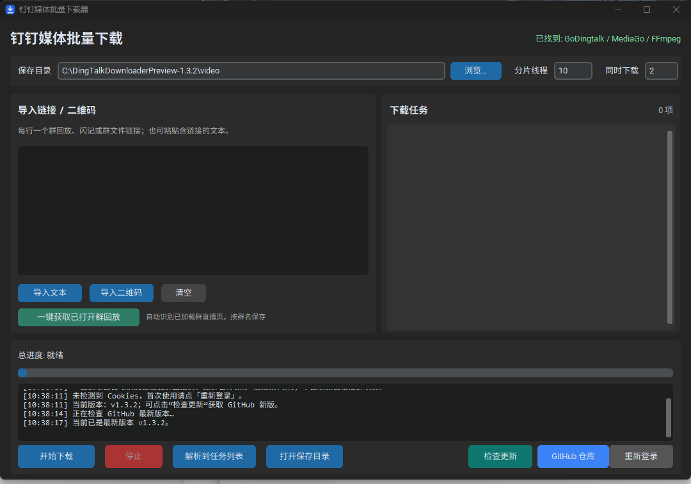
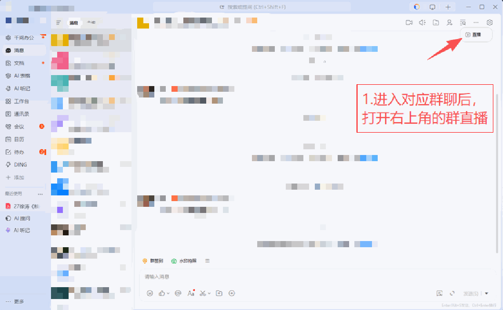
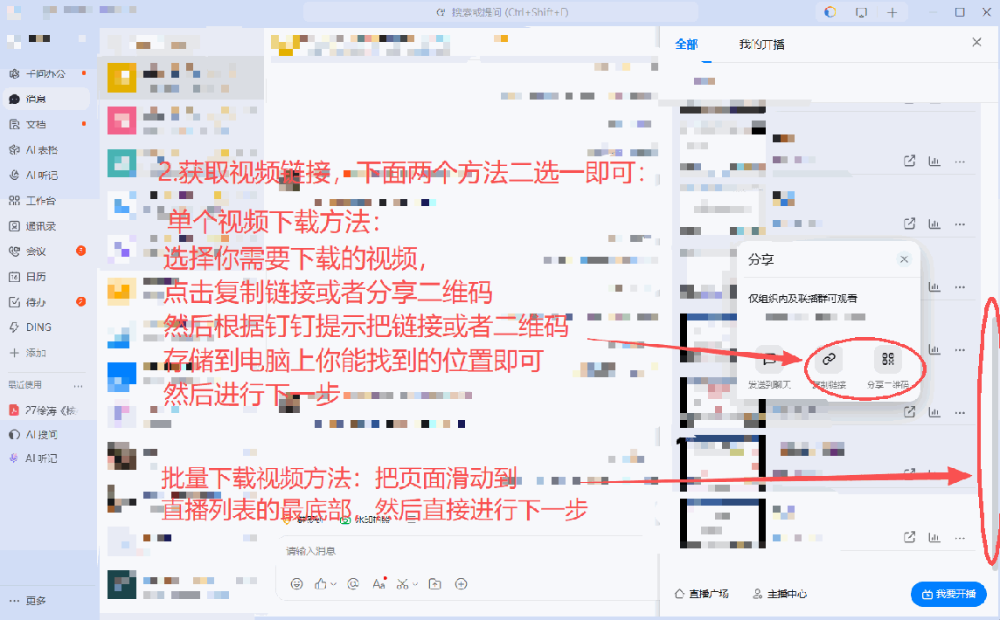
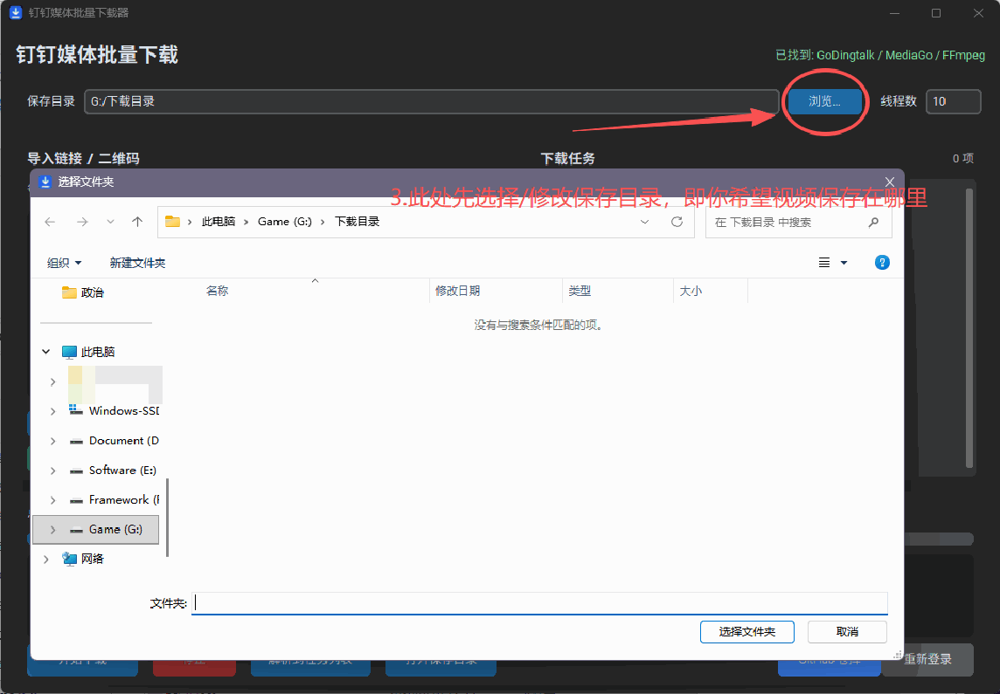
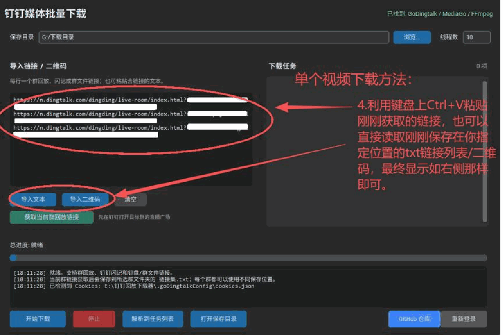
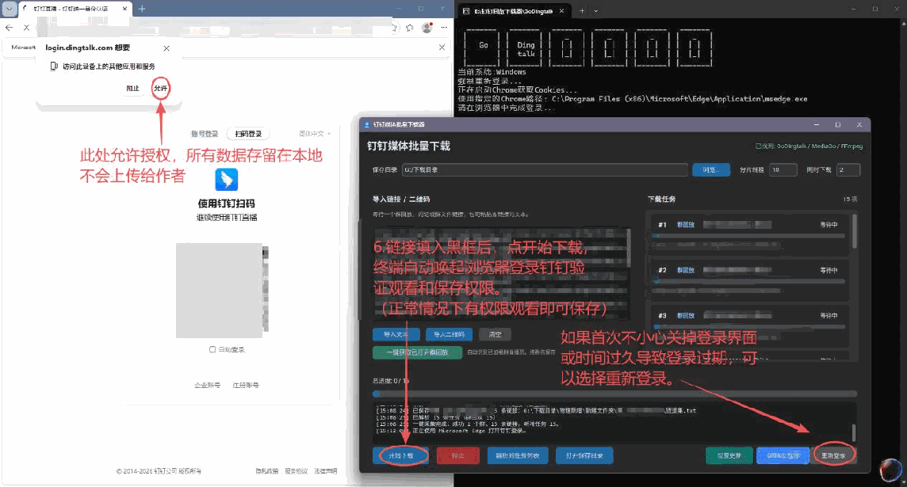
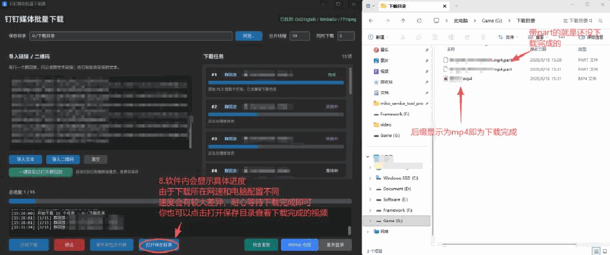
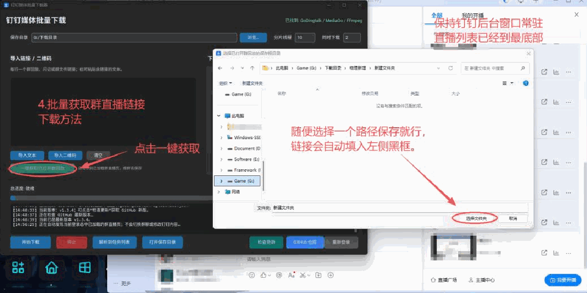
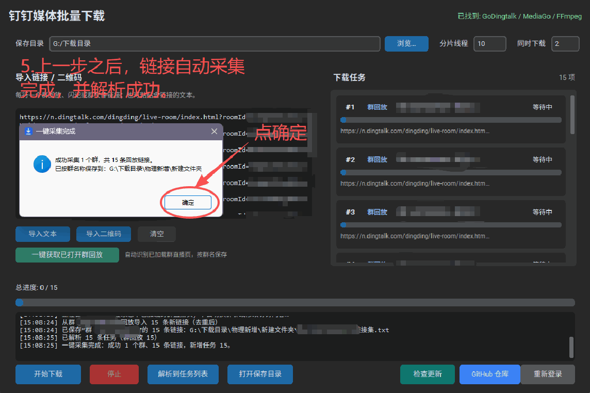
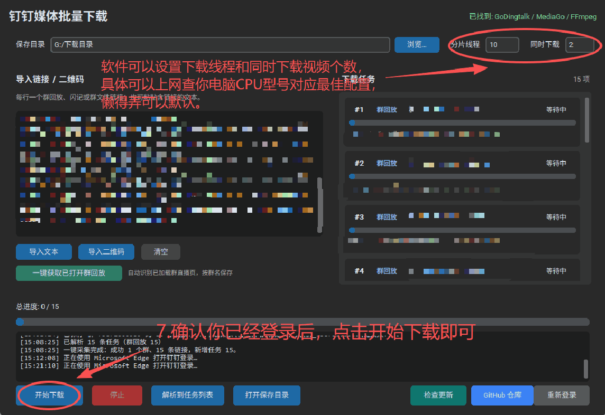

<p align="center">
  
</p>

<h1 align="center">钉钉回放下载器</h1>

<p align="center">
  面向 Windows 的中文图形化工具，用于整理和下载你有权访问的钉钉群直播回放、闪记记录，以及群文件/钉盘媒体。
</p>

<p align="center">
  <a href="https://github.com/ULing19/DingTalkDownloader/releases">下载发行版</a>
  ·
  <a href="https://github.com/NAXG/GoDingtalk">GitHub 上游仓库</a>
  ·
  <a href="https://github.com/Sophomoresty/mediago/releases/tag/v0.3.0">MediaGo</a>
  ·
  <a href="https://github.com/ULing19/DingTalkDownloader/issues">反馈问题</a>
</p>

## 交流与反馈

1.3.16 修复部分 Edge/Windows 环境无法唤起登录窗口的问题：恢复稳定的 GoDingtalk 原生登录链路，避免默认依赖独立 CDP 调试窗口；独立 CDP 仅作为诊断实验开关保留。

1.3.13 修复高 DPI、窄屏和低分辨率下底部操作按钮显示不完整的问题：底部按钮改为两行响应式布局，支持 125%/150%/200% 缩放及小尺寸窗口。

1.3.12 修复多条二维码/钉盘链接并行解析时前面的任务被 MediaGo 状态冲突影响的问题：二维码任务改为独立保留、串行解析并对短暂网络/解析失败自动重试，不会只剩最后一个任务。

1.3.12 修复已授权后因失效代理导致的登录校验连接失败，钉钉登录校验改为证书验证的直连，并优化高 DPI 与窄屏界面布局。详见 [登录网络修复说明](docs/login-network-fix.md)。

> `1.3.10` 已接入直播分享短链和按需输入观看密码的流程，并完成两条真实密码分享的完整下载测试。该测试版同时兼容本机旧会话失效和官方返回旧式 HTTP 媒体地址的情况。详见 [测试版使用说明与支持边界](docs/password-sharing.md)。已发布正式版的功能以对应发行说明为准。

- QQ群：`1103756143`
- 问题反馈：<https://github.com/ULing19/DingTalkDownloader/issues>

> 本项目不是钉钉官方软件。请只处理你本人有权观看或下载的内容，并遵守钉钉服务条款、版权法规和所在组织的使用规定。

> 严禁将本软件用于盗版传播、侵权分发或其他违法用途；因违规使用产生的后果由使用者自行承担。若当前网络无法访问 GitHub，请忽略软件内的更新提示，继续使用当前版本，并通过项目维护者提供的可信网盘渠道获取更新包，核对版本号、文件名和校验值后再安装。

### 32 位实验版

[v1.3.16 Release](https://github.com/ULing19/DingTalkDownloader/releases/tag/v1.3.16) 同时提供 Windows x64 正式安装包/绿色版，以及 Windows x86 实验安装包/绿色版。32 位包中的主程序、GoDingtalk、MediaGo 和 FFmpeg 均为 x86；当前仅在 64 位 Windows 兼容环境完成启动和架构检查，真实 32 位 Windows 请先用短视频验证完整链路。

## 这份 README 怎么读

如果你只是想使用软件，按“快速开始”操作即可；如果你想学习实现方式，可以继续阅读“工作原理”和“从源码运行”。本文档中的链接参数、保存目录和账号信息均使用公开示例、占位符或隔离预览目录，不包含作者或用户电脑上的真实数据。

## 项目定位

这个项目适合用来学习一个桌面下载工具如何把多个来源统一成一条任务流水线：

- 识别不同格式的 URL，并把它们分发给对应引擎；
- 复用本机登录态完成权限校验，不保存密码，也不绕过权限；
- 群回放优先保留完整 HLS 播放列表，再由 FFmpeg 按原时间轴合并；
- 下载后检查 MP4 音视频轨的起止时间，对明显不完整的结果给出提示；
- 对普通文件保留原始扩展名，不把文档强制转换成视频；
- 将解析、下载、转换和日志展示放到图形界面中；
- 在不同链接生成同名文件时自动编号，避免覆盖已有结果；
- 支持受限的多视频并发：分别控制单视频分片线程和同时下载的视频数量，避免无限制占满带宽；
- 后台检查 GitHub 最新 Release，用户确认后下载并校验 SHA-256，再启动安装版或绿色版更新流程。

### 1.3.9 群直播完整源与稳定性修复

- 群直播默认优先使用 GoDingtalk 获取完整分片，MediaGo 仅作为兼容回退，避免短 HLS 播放列表被误判为完整视频。
- 群直播分片并发限制为 4，HTTP 超时延长到 120 秒；网络抖动时自动重试最多 3 次，未完成分片不会标记为成功。
- 保留音视频轨道检查和同名文件编号规则；闪记、钉盘/群文件仍由 MediaGo 处理。

### 1.3.8 登录目录与多浏览器兼容更新

- 安装版和绿色版都会预置程序目录下的 `.goDingtalkConfig\config.json` 与 `cookies.json`，内容固定为空 JSON；首次运行也会自动修复缺失或 0 字节占位文件。实际登录态仍保存在当前 Windows 用户目录，发布包不会携带任何真实 Cookie。
- 登录态不再回退到可能被系统清理的临时目录；会优先复用其它持久目录中已有的有效会话，并可将旧版程序目录的有效 Cookie 迁移到用户目录，不覆盖任何非空会话。
- 软件唤起独立浏览器授权窗口并扫描其中的全部页面；兼容浏览器启动器提前退出、页面跳转以及多个 Edge/Chrome 窗口同时在线，只读取钉钉域 Cookie。已记忆浏览器无法打开授权页时只会自动换一个已安装浏览器重试一次，不会循环拉起窗口。

### 1.3.7 标题一致性与选择下载更新（历史）

- 自动采集的回放标题会从新版/旧版钉钉记录的顶层字段、嵌套字段和 URL 配对回退数据中统一提取，任务列表与最终文件名优先使用群直播原标题；标题缓存支持参数顺序变化和 1.3.6 旧格式迁移。
- 点击“解析到任务列表”后，每条任务前都有勾选框；可以只勾选需要的视频，也可以使用“全选”“全不选”，未勾选项目不会启动下载。
- 相同标题的不同回放仍会自动追加 `(1)`、`(2)`，不会覆盖已有视频；下载进度按原列表序号更新。

### 1.3.6 登录与浏览器兼容更新（历史）

- 首次运行会自动创建合法的空 `config.json` 与 `cookies.json`，不会因目录中没有 Cookie 而提前失败；
- 登录会话优先放在当前 Windows 用户可写的 `%LOCALAPPDATA%`，重定向目录不可写时自动切换到稳定的用户目录；
- 登录授权使用软件创建的独立 Edge/Chromium 临时窗口，直接打开钉钉授权页，并兼容新版 Chromium 的 DevTools Origin 校验；
- 同一时间只允许一个登录授权窗口，完成或取消后会清理本次临时浏览器进程，不读取或覆盖日常浏览器配置。

### 1.3.5 登录会话兼容更新（历史）

- 登录会话改为保存在当前 Windows 用户可写且跨安装目录稳定的 `%LOCALAPPDATA%\DingTalkDownloader\.goDingtalkConfig\`；首次启动会复制旧版程序目录中的会话，旧文件仍保留；
- “重新登录”不再只负责打开浏览器：软件会等待授权引擎退出，检查账号令牌、设备标识等必要字段，并通过钉钉只读注册接口确认会话被接受后才显示成功；该检查不读取群数据，也不代表拥有某个群的回放权限；
- 点击下载时会先在后台校验会话；只有钉钉明确拒绝会话时才触发一次授权，网络连接失败只提示稍后重试，不会反复弹出登录；授权成功后自动继续刚才的任务；
- 登录与下载始终向 GoDingtalk 显式传入同一份 `config.json`、`cookies.json` 和已选 Chromium 浏览器路径，避免 Edge-only 电脑在兼容回退时再次寻找 Chrome；
- 登录、采集、下载和更新互斥运行；软件限制为单实例，关闭窗口时会停止当前下载并回收本次启动的登录/下载进程，避免旧进程覆盖新会话；
- 界面不增加按钮，仍使用现有“重新登录”和“开始下载”完成整个流程。

### 1.3.4 浏览器兼容更新

- 电脑需要有至少一个可正常启动的 Chromium 内核浏览器；不要求额外安装 Google Chrome，Windows 10/11 会优先自动使用系统自带的 Microsoft Edge；
- 同时自动发现 Chrome，以及 Brave、Chromium、Vivaldi、Opera、360、QQ 等 Chromium 内核浏览器；第三方浏览器能否登录取决于其 Chromium 调试接口兼容性；
- 自动检测不到时，仍使用原有“重新登录”按钮选择一次 Chromium 浏览器程序，并在本机记住路径，不增加新的界面按钮；
- 下载阶段只读取本机登录会话，不依赖浏览器持续运行。Firefox 不提供 GoDingtalk 所需的 Chromium 调试接口，因此不能用于自动登录。

### 1.3.3 修复重点

- 修复“一键获取”完成后调用“解析到任务列表”可能直接失败的问题；
- 只读 RPC 优先获取完整“全部”分页；内存回退若同时发现“全部”和筛选请求会停止写入，避免把筛选子集误当成完整列表；
- 采集时保留钉钉回放原标题，并在本机应用数据中用 URL 的 SHA-256 哈希键缓存群名和标题，重启后重新导入 `链接集.txt` 仍使用群内标题；
- 钉钉重启同一群的页面渲染进程时自动续接，不再要求 PID 始终不变；
- 同名结果已经由引擎生成 `(1)` 时直接保留，不会错误跳到 `(2)`。

## 界面预览

左侧输入链接，右侧查看任务和日志，底部统一控制登录、保存目录与 GitHub 仓库入口。

<p align="center">
  
</p>

## 支持的链接类型

| 类型 | 示例格式（仅示意） | 处理方式 | 使用条件 |
| --- | --- | --- | --- |
| 群直播回放 | `https://n.dingtalk.com/dingding/live-room/index.html?roomId=<房间ID>&liveUuid=<回放ID>` | 解析回放媒体，必要时下载分片并合并 | 账号能观看该回放 |
| 钉钉闪记 | `https://shanji.dingtalk.com/app/transcribes/<转写ID>` | 读取记录中的可播放媒体 | 需要登录和记录权限 |
| 群文件/钉盘 | `https://qr.dingtalk.com/page/yunpan?route=previewDentry&spaceId=<空间ID>&fileId=<文件ID>&type=file` | 读取 CSpace 元数据；视频走播放流，普通文件走直链 | 需要文件查看/下载权限 |

三类链接对应不同的后端对象。闪记链接中的最后一段是记录 ID，群文件链接中的 `spaceId` 和 `fileId` 是云盘对象标识，不要把它们改写成 `roomId` 或 `liveUuid`。

### 文件类型边界

群文件/钉盘视频通常通过播放流下载，并按需要由 FFmpeg 合并。PDF、Office、图片或压缩包只有在解析器拿到**直接下载地址**时才会按原始扩展名保存；预览地址、文件夹、权限不足或没有直链的条目会提示没有可下载媒体。闪记记录也可能只有音频或转写文本，不保证存在视频画面。

## 工作原理

<p align="center">
  
</p>

一次下载大致经过以下步骤：

1. 用户在钉钉完成登录，程序复用本机授权状态检查访问权限。
2. GUI 读取粘贴文本、文本文件或二维码中的 URL，并做基本格式校验。
3. MediaGo 解析群回放、闪记或钉盘媒体；群回放优先返回包含全部标签的原始 HLS 播放列表。
4. FFmpeg 保留钉钉源 PTS、统一从零起算并映射首个音视频轨；群直播优先由 GoDingtalk 获取完整源，MediaGo 作为兼容回退。
5. MP4 完成后读取容器轨道时间轴，检查音视频起点和结束时间是否明显失衡。
6. 任务列表更新进度和日志，输出文件按标题生成；如果标题重复则追加 `(1)`、`(2)` 等编号。

### 已打开群回放链接采集

主程序只保留一个“一键获取已打开群回放”入口，不需要维护群聊记忆：

1. 在钉钉登录，并打开需要处理的群“直播广场”；多个群可分别打开直播页。
2. 回到下载器，点击输入区下方的“一键获取已打开群回放”。程序会自动发现当前登录态中已打开的群直播页；RPC 通常会自动读取全部分页，为兼容新旧钉钉及回退采集，建议先将列表滚动到末页并保持页面打开。
3. 选择一次保存根目录；程序按已识别的群名称建立文件夹，将链接写入对应的 `链接集.txt`，同时加入输入框和任务列表。

该功能不会依赖已记忆群映射。它会一次处理当前登录态中所有仍打开的群直播页，但不会枚举或自动打开账号中未打开的群；未打开直播页的群无法凭空读取回放。程序不会自动点击群聊或发送消息。群名优先来自当前钉钉日志或进程中的只读群元数据，并在本机缓存；确实没有名称时才显示 `群_<CID>` 作为安全兜底。

采集器从 CEF 日志识别当前群 CID，使用本机登录态调用钉钉回放列表的只读 LWP RPC 并自动翻页；RPC 不可用时才回退到经过严格校验的渲染进程内存。它不点击群聊、不发送消息，也不调用任何写操作。群身份无法确认或保存目录不可访问时，不会覆盖原有链接文件。

## 快速开始

安装版和绿色版是两种**二选一**的使用方式，不需要同时安装。首次使用前请先阅读下面的图文教程：

- [下载中文图文使用教程（PDF）](docs/DingTalkDownloader_UserGuide_zh-CN.pdf)
- [下载中文图文使用教程（DOCX）](docs/DingTalkDownloader_UserGuide_zh-CN.docx)

## 图文操作步骤

下面的步骤图取自仓库内的中文使用教程。截图中的群名、群消息、账号信息、链接后缀和文件名均已做遮挡处理，仅用于说明按钮位置和操作顺序。

### 专题一：单个视频下载

适合只下载一条群直播回放，或先用一个链接验证当前账号和网络环境。

1. 在钉钉中进入目标群的“直播广场”，找到需要保存的回放。

<p align="center"></p>
<p align="center"><sub>步骤 1：打开目标群的直播广场。</sub></p>

2. 在回放卡片的分享菜单中复制链接；也可以保存二维码后在下载器中识别。

<p align="center"></p>
<p align="center"><sub>步骤 2：复制回放链接，或使用分享二维码。</sub></p>

3. 在下载器中选择可写的保存目录，将完整链接粘贴到左侧输入框，再点击“解析到任务列表”。

<p align="center"></p>
<p align="center"><sub>步骤 3：选择保存目录，保存位置不限定为某个盘符。</sub></p>

<p align="center"></p>
<p align="center"><sub>步骤 4：导入链接或二维码，确认任务列表中只出现目标视频。</sub></p>

4. 首次使用或会话过期时，点击软件内的登录入口。软件会优先唤起 Microsoft Edge，授权必须在软件打开的浏览器窗口中完成。

<p align="center"></p>
<p align="center"><sub>步骤 5：在软件唤起的浏览器窗口中完成钉钉授权。</sub></p>

5. 确认任务状态和保存目录后点击“开始下载”。完成后点击“打开保存目录”检查文件；同名结果会自动追加编号，不会覆盖旧文件。

<p align="center"></p>
<p align="center"><sub>步骤 6：确认任务后开始下载。</sub></p>

<p align="center"></p>
<p align="center"><sub>步骤 7：打开保存目录，确认 MP4 文件已经生成。</sub></p>

### 专题二：批量获取并下载当前群回放

适合一次获取当前已打开群直播广场中的多条回放。程序只读取已打开的页面，不会自动枚举账号中未打开的群，也不会发送消息或点击群聊。

1. 在钉钉中打开目标群的直播广场，并将回放列表滚动到末页后保持页面打开。这样更容易让新版钉钉完成全部分页加载。

<p align="center"></p>
<p align="center"><sub>步骤 1：保持目标群直播列表的末页打开。</sub></p>

2. 回到下载器，点击“一键获取已打开群回放”。程序会自动读取当前登录态中仍打开的群直播页面，并按群名整理链接。

<p align="center"></p>
<p align="center"><sub>步骤 2：点击一键获取入口，等待采集完成。</sub></p>

3. 检查采集数量、群名称、回放标题和保存目录，再点击“解析到任务列表”。不需要下载的项目可以取消勾选。

<p align="center"></p>
<p align="center"><sub>步骤 3：确认群名、标题和任务数量。</sub></p>

4. 在任务列表中选择需要的项目，设置“同时下载”数量后点击“开始下载”。网络或电脑负载较高时，建议先使用 1-2 个并发任务。

<p align="center"></p>
<p align="center"><sub>步骤 4：设置并发数量后开始批量下载。</sub></p>

5. 下载完成后打开保存目录，按钉钉群内标题检查文件名和 MP4 状态。相同标题的不同链接会保存为 `标题.mp4`、`标题 (1).mp4`、`标题 (2).mp4`。

<p align="center"></p>
<p align="center"><sub>步骤 5：查看下载进度、完成状态和同名文件编号。</sub></p>

### 三类链接如何选择

| 你要处理的内容 | 入口或链接类型 | 推荐操作 |
| --- | --- | --- |
| 一条群直播回放 | `n.dingtalk.com/dingding/live-room/...` | 使用“单个视频下载”流程 |
| 当前群多条回放 | 已打开的群“直播广场” | 使用“一键获取已打开群回放”流程 |
| 闪记记录 | `shanji.dingtalk.com/app/transcribes/...` | 粘贴完整链接后解析 |
| 群文件或钉盘视频 | `qr.dingtalk.com/page/yunpan?...` | 保留 `spaceId`、`fileId` 等原始参数后解析 |

二维码只是链接载体，识别后仍需确认它对应的是视频、闪记还是普通文件；普通 PDF、Office、图片和压缩包只有在钉钉返回直接下载地址时才会保存。

### 方式一：安装版（推荐）

从 [Releases](https://github.com/ULing19/DingTalkDownloader/releases) 下载 `DingTalkDownloader_1.3.9_Setup.exe`，按安装向导完成安装。向导可以创建桌面快捷方式和开始菜单项，安装后可从 Windows 设置、开始菜单卸载项或安装目录中的卸载程序移除软件。

卸载程序会保留安装目录中的 `video\` 和旧版 `.goDingtalkConfig\`，以免误删下载结果；新版登录会话保存在 `%LOCALAPPDATA%\DingTalkDownloader\.goDingtalkConfig\`，卸载或覆盖安装不会清除。卸载时会删除 `%LOCALAPPDATA%\DingTalkReplayLinkCollector` 中的标题映射和保存目录缓存。Windows SmartScreen 可能显示“未知发布者”，请只从本仓库 Release 下载，并按发布页核对 SHA-256。

### 方式二：绿色版

同一 Release 提供 `DingTalkDownloader_1.3.9_Portable.zip`。解压到任意位置后双击 `DingTalkDownloader.exe` 即可使用，不写入系统安装项。以下运行时文件必须与主程序保持同一目录：

```text
DingTalkDownloader.exe
GoDingtalk_v2.5.2_windows_amd64.exe
mediago.exe
ffmpeg.exe
.goDingtalkConfig\config.json
.goDingtalkConfig\cookies.json
```

压缩包中的两个 JSON 只是 `{}` 占位文件，不含账号数据。软件授权后的真实登录态仍保存在 `%LOCALAPPDATA%\DingTalkDownloader\.goDingtalkConfig\`，因此不要手动把真实 Cookie 填入绿色包再转发。

绿色版的卸载方式是退出程序后删除解压目录；删除前请备份 `video\`。若要同时清除登录状态，请删除 `%LOCALAPPDATA%\DingTalkDownloader`；若还要清除采集器的标题映射和保存目录记录，请一并删除 `%LOCALAPPDATA%\DingTalkReplayLinkCollector`。

## 首次使用

1. 启动程序，点击软件内的“重新登录”入口。程序会自动唤起可用的 Chromium 浏览器完成授权，优先使用 Windows 自带的 Microsoft Edge，无需另装 Google Chrome；未自动识别时按提示选择一个 Chromium 浏览器程序。
2. 确认当前账号能在钉钉中打开目标回放、闪记或群文件。
3. 将完整 URL 粘贴到左侧输入区，或导入文本文件、二维码图片；每行一个 URL，`#` 开头的行会被忽略。
4. 点击“解析到任务列表”，检查链接类型和群内原标题；确认不需要的视频取消勾选（也可点击“全不选”后再勾选指定项目）。
5. 选择保存目录、单视频分片线程数和同时下载的视频数，点击“开始下载”；只有勾选的项目会进入下载，完成后点击“打开保存目录”。

软件启动后会在后台检查 GitHub Release，也可以点击底部“检查更新”。发现新版时会先展示版本、文件类型和大小，用户确认后才下载；下载完成必须通过 SHA-256 校验。下载任务进行中不会启动更新。安装版由安装程序更新；绿色版由独立进程等待主程序退出，先预备全部新文件和旧文件备份，再原子替换，失败会自动回滚。`video`、`.goDingtalkConfig` 和其它用户文件不会被更新包删除。

登录只证明当前账号的访问能力，不会提升群成员权限。会话保存在 `%LOCALAPPDATA%\DingTalkDownloader\.goDingtalkConfig\`，不会自动上传 GitHub 或发送给项目作者。旧版程序目录中的 `.goDingtalkConfig\` 只在目标文件不存在时复制一次，不会被自动删除。不要公开 `cookies.json`、浏览器 Cookie 导出文件、二维码截图中的私密链接或带令牌的日志。

登录窗口使用独立会话，不会直接导入日常浏览器中的 Cookie。程序保证检测 Microsoft Edge，并兼容 GoDingtalk 原生支持的 Chrome；Brave、Chromium、Vivaldi、Opera 以及 Chromium 内核的 360/QQ 浏览器会自动发现并尝试，实际结果取决于具体版本。Firefox、Safari 和旧版 Internet Explorer 不兼容该登录引擎。登录授权必须通过软件内的入口唤起浏览器完成，不要手动复制 Cookie。完成一次有效登录后，解析和下载不要求浏览器保持打开。

## 保存结果与重名规则

默认输出目录是程序目录下的 `video\`，也可以在界面中选择其他目录或建立子目录，例如：

```text
<保存根目录>\数学-基础\
<保存根目录>\英语-强化\
```

文件名来自任务标题。不同链接即使标题相同，也会保留每个下载结果：

```text
同名视频.mp4
同名视频 (1).mp4
同名视频 (2).mp4
```

程序会同时检查已存在的目标文件和下载中的临时文件，避免重试或多来源下载时相互覆盖。

## 音画同步与完整性检查

`1.3.4` 中，群回放优先通过 MediaGo 取得完整 HLS 播放列表。这样 `EXT-X-DISCONTINUITY` 等时间轴标签会交给 FFmpeg 处理，而不是先把 TS 分片按字节拼接后再转换。钉钉屏幕共享可能合法地几十秒不产生新视频帧；FFmpeg 默认会把这种稀疏帧间隔误判为时间戳跳变并压缩视频轴。程序现在使用 `-copyts -start_at_zero` 保留源 PTS 后统一从零起算，显式选择首个视频轨和音频轨，并为媒体解析和网络读取设置超时；这些操作不重新编码画面或裁掉音频。

下载结束后，程序直接读取 MP4 容器中的轨道元数据，不需要额外安装 FFprobe。以下情况会在任务结果中提示检查：

- 音视频起点相差超过约 `0.25` 秒；
- 两条轨道的结束时间相差超过 `2` 秒；
- 群回放 MP4 无法确认同时包含可读取的音轨和视频轨。

这些任务会显示为“需检查”，最终弹窗也会汇总数量。提示不会删除已下载文件，也不会用 `-shortest` 静默裁掉较长的音频。若源回放本身缺少后段视频分片，重新封装无法生成不存在的画面；请先用原链接重试，重复出现时再确认钉钉中的源回放是否也会提前定格。旧版已经下载的文件不会被自动改写。

## 从源码运行

环境要求：Windows 10/11、Python 3.9 或更高版本。GUI 依赖见 `requirements-gui.txt`。

```powershell
python -m pip install -r requirements-gui.txt
python gui_downloader.py
```

从源码运行时，请把以下运行时文件放在项目根目录（或程序查找的同目录）：

- `GoDingtalk_v2.5.2_windows_amd64.exe`：来自 [NAXG/GoDingtalk Releases](https://github.com/NAXG/GoDingtalk/releases)。
- `mediago.exe`：来自 [Sophomoresty/mediago v0.3.0 Windows Release](https://github.com/Sophomoresty/mediago/releases/tag/v0.3.0)。
- `ffmpeg.exe`：来自 [FFmpeg 官方下载页](https://ffmpeg.org/download.html)。

不要把登录配置、下载结果、真实二维码、Cookie 或包含私密参数的链接提交到 Git。建议先检查 `git status`，确认 `.goDingtalkConfig\`、`video\` 和个人测试文件未被加入提交。

## 构建与测试

```powershell
build_exe.bat
build_installer.bat
python -m pytest -q
```

构建脚本会生成 PyInstaller 输出、安装包和绿色版压缩包。发布前建议检查：

- 安装程序能创建快捷方式并在 Windows 设置中登记卸载项；
- 绿色版解压后四个运行时文件仍在同一目录；
- 登录、三类链接解析、二维码导入和同名文件编号均能完成最小链路测试；
- Release 资产只包含公开构建产物，不包含本机配置或测试数据。

## 目录结构

```text
gui_downloader.py              # CustomTkinter 图形界面与任务队列
browser_support.py             # Edge 与其他 Chromium 登录浏览器检测
dingtalk_media.py              # 媒体地址、文件名和输出处理
dingtalk_replay_extractor.py   # 当前群直播广场的只读链接识别
replay_link_collector.py       # 链接文件保存与位置记忆
GoDingtalk_v2.5.2_windows_amd64.exe
mediago.exe
ffmpeg.exe
requirements-gui.txt
DingTalkDownloader.spec        # PyInstaller 配置
installer\setup.iss            # 安装、快捷方式与卸载
assets\download.ico            # 应用图标
docs\images\                  # 界面预览和流程图
video\                         # 默认输出目录（本地数据）
%LOCALAPPDATA%\DingTalkDownloader\.goDingtalkConfig\  # 本机配置与登录会话
```

## 常见问题

**提示“未找到下载引擎”**：确认主程序、GoDingtalk、MediaGo 和 FFmpeg 在同一目录，并检查安全软件是否隔离了其中的文件。

**没有安装 Google Chrome，点击“重新登录”失败**：升级到 `1.3.9`。程序会优先寻找 Microsoft Edge；若电脑精简系统中也没有 Edge，请安装任一 Chromium 浏览器或按提示选择其可执行文件。Firefox 不能代替 Chromium 完成自动登录。

**登录窗口停在 `about:blank`、浏览器没有打开或同时打开多个浏览器后无法识别登录**：升级到 `1.3.9`，退出旧版下载器后再次点击“重新登录”。只需在软件唤起的独立授权窗口中完成操作，其它浏览器无需关闭；记忆的浏览器失效时软件最多再换一个浏览器重试，不会连续打开大量窗口。

**首次运行提示找不到 Cookie**：不需要手动创建或复制 Cookie。1.3.9 的安装版和绿色版都包含程序目录空占位文件，程序还会在可写的用户目录准备真实会话文件，授权完成后自动写入；若默认 `%LOCALAPPDATA%` 被策略重定向，日志会显示实际使用的持久备用目录。

**提示“缺少 roomId 或 liveUuid”**：不要把闪记或群文件 URL 当成直播 URL；升级到 `1.3.9`，并粘贴完整原始链接。

**浏览器授权成功，但点击下载又反复要求登录**：升级到 `1.3.9`。新版会等待会话完整写入，优先复用已有的持久会话，并让登录、MediaGo 与 GoDingtalk 共用同一份 `cookies.json`；下载前只进行一次在线校验，断网不会误判成掉登录。等待软件提示“登录成功”后再操作，不要发送 Cookie 内容。

**闪记提示缺少 `account/access_token` 或 `deviceid`**：登录会话不完整或已过期。点击“重新登录”，并确认同一账号能在浏览器打开闪记页面。

**群文件提示“不支持 URL”**：保留 `route=previewDentry`、`spaceId`、`fileId` 和 `type=file` 参数，不要手工改写查询参数。

**群文件提示“没有可下载媒体”**：先用同一账号在钉钉客户端打开原链接。若客户端也无权访问，请让文件所有者或群管理员授权；程序不会绕过权限。能预览但下载失败时，再检查转码状态或是否确实存在直接下载地址。

**只有 TS，没有 MP4**：确认同目录存在 `ffmpeg.exe` 且未被拦截，再重试失败任务；不要在下载过程中移动程序目录。

**提示“视频轨比音频早结束”**：先确认使用 `1.3.4` 或更高版本重新下载；新版已修复稀疏屏幕共享帧被 FFmpeg 压缩时间轴的问题。若重新下载后仍提示且钉钉客户端也在同一位置定格，通常是源回放或源分片本身不完整。

**二维码识别失败**：使用清晰原图并保留二维码四周空白；也可以直接复制二维码打开后的完整 URL。

**“一键获取已打开群回放”失败**：确认钉钉已登录、目标群“直播广场”仍保持打开，并且当前 Windows 用户目录中的登录会话有效；按提示选择已有可写保存根目录。失败不会覆盖旧的 `链接集.txt`。

**新版钉钉直播广场读取不稳定**：将目标群直播列表滚动到末页并保持页面打开后重试。采集器会优先通过登录态只读 RPC 自动读取全部分页，并严格核对每条记录的群 ID；旧版兼容回退仍支持不同 `Navigation` 日志事件、查询参数顺序、`data/records` 包装和字段别名。若仍失败，请提供已经脱敏的版本号、任务数量和错误摘要，不要上传内存转储、Cookie 或完整链接。

**同时下载多少个视频合适**：默认同时下载 `2` 个视频、每个视频使用 `10` 个分片线程。网络或电脑负载较高时先降低“同时下载”，不要简单把两个数都调到最大。

## 上游引用与许可证

本项目的 GUI 代码通过同目录引擎完成下载，并引用 [NAXG/GoDingtalk](https://github.com/NAXG/GoDingtalk) 作为群回放兼容链路。项目还集成了 [Sophomoresty/mediago v0.3.0](https://github.com/Sophomoresty/mediago)，用于群回放原始 HLS、闪记和 CSpace/钉盘媒体解析；FFmpeg 用于分片合并和容器转换。

GoDingtalk、MediaGo、FFmpeg 及其他依赖分别遵循各自许可证。请阅读 [THIRD_PARTY_NOTICES.md](THIRD_PARTY_NOTICES.md)，再进行再分发。MediaGo 仓库标注 The Unlicense，但这不等同于钉钉官方授权，也不能自动解决第三方代码、平台接口或内容版权问题。

本项目自有 GUI 代码以 MIT License 发布，详见 [LICENSE](LICENSE)。

## 隐私、版权与责任边界

- `%LOCALAPPDATA%\DingTalkDownloader\.goDingtalkConfig\` 以及旧版程序目录中的 `.goDingtalkConfig\` 可能包含登录会话，严禁提交到 GitHub 或公开分享。
- `%LOCALAPPDATA%\DingTalkReplayLinkCollector` 保存 URL 哈希到群名/原标题的本机映射，不保存 Cookie；安装版卸载时会删除，绿色版可手动删除。
- `video\`、链接文本、二维码截图、日志和文件名都可能包含个人或组织信息，发布前请脱敏。
- 只下载你有权访问的回放或文件，并自行确认组织授权、内容版权和平台规则。
- 项目作者不提供账号代登录、不索取密码或 Cookie，也不保证平台接口长期稳定。

当前 GUI/安装包版本：`1.3.9`。
